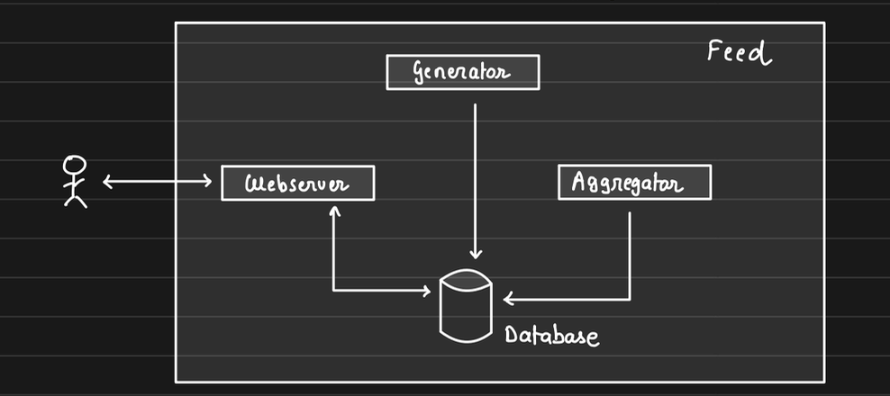

# What is System Design

Set of requirements
- Decide architecture
- Decide components
- Decide modules

↑ How they interact with each other → *To solve the problem* → that is almost → "Product Development"

**Why is it so popular?**

* Every single tech product is a *system* this has been *designed*
* Companies are building products and need you all to design it

**Why understanding system design is important?**

* This is what people do at work
* Everything is practical
* You can see it from Day 1 of joining the company
* Once you grow in your career you will spend 80% of your time doing this

**Conclusion:**
System design is hence relevant for literally everyone

## Side Effects of System Design

- It makes everything else uninteresting
- You solve **real problems**, not something made up
- Break down problem statement systematically
- Rewires your brain to think in a **structured way**
- By considering all positive cases to deliver a great user experience

## What will we do when we design a system?

- Break down problem statement into solvable subproblems
- Decide on key components and requirements
- Decide on boundaries of each component
- Touch upon key challenges in scaling it
- Make our architecture **fault tolerant** and **available**

## How to approach System Design?

System Design is **extremely practical** and there is a **structured way** to take the situation.

**Take baby steps, no matter what!**

1. **Understand the problem statement**
   
   Without having a thorough understanding of the problem at hand, we would easily digress.

2. **Break it down into components** *(essential)*

**Note:** To start with,

* Do **not** create components for the sake of it.
* Create components that you know are **must-have**.

**Example:** *Design Facebook*

**Components / Features:** when problem statement is too big

* Auth
* Notification
* Feed
* Gamification

3. **Dissect each component (if required)**

   Example: *Feed* might have – generator, aggregator, web server

4. **For each sub-component look into:**
* Database and caching
* Scaling & fault tolerance
* Async processing (Delegation)
* Communication

Repeat for each sub-component one-by-one

5. **And more sub-components look into:**

* Understand the scope
* Decide how other components will talk with this resource
* Decide on 4 above factors for this new component
* Repeat

## How do you know that you have built a good system?

Every system is "infinitely buildable", and hence knowing when to stop the evolution is important.

Here are some pointers that will help you:

1. You are able to brake your system into components

2. Every component has a clear set of responsibilities → exclusive

* Feed Server → Serves feed over HTTP
* Feed Generator → Pulls data from multiple services and puts them in DB
  - Candidate feed items
  - posts, friends, recommendations
* Feed Aggregator → Combines candidate items fetched by generator.
  - Filters out redundant, ranks, and creates a final consumable feed

3. For each component you have slight technical details figured out:

* Database and caching
* Scaling and fault tolerance
* Async processing (Delegation)
* Communication

4. Each component (in isolation) is:

* Scalable → Horizontally scalable
* Fault tolerant → Plan for recovery in case of a failure → to a stable state (*mostly data*)
* Available → Component functions even when some component *fails*

> This is precisely how we would tackle every single system — **structured and detailed**.

# Relational Databases

Databases are the most critical component of any system — they can make or break a system.

Data is stored & represented in rows and columns.

## History of relational databases

* Computers → Internet → Blockchain
* Everything revolutionary starts with Financial Applications
* Computers first did "accounting" → ledgers → rows & columns
* Databases were developed to support accounting

## Key properties

1. Data consistency
2. Data durability
3. Data integrity
4. Constraints
5. Everything in one place

Because of these reasons, relational databases provide "Transactions".

## ACID

* **A** – Atomicity
* **C** – Consistency
* **I** – Isolation
* **D** – Durability
