# What is System Design

Set of requirements
- Decide architecture
- Decide components
- Decide modules

↑ How they interact with each other → *To solve the problem* → that is almost → "Product Development"

**Why is it so popular?**

* Every single tech product is a *system* this has been *designed*
* Companies are building products and need you all to design it

**Why understanding system design is important?**

* This is what people do at work
* Everything is practical
* You can see it from Day 1 of joining the company
* Once you grow in your career you will spend 80% of your time doing this

**Conclusion:**
System design is hence relevant for literally everyone

## Side Effects of System Design

- It makes everything else uninteresting
- You solve **real problems**, not something made up
- Break down problem statement systematically
- Rewires your brain to think in a **structured way**
- By considering all positive cases to deliver a great user experience

## What will we do when we design a system?

- Break down problem statement into solvable subproblems
- Decide on key components and requirements
- Decide on boundaries of each component
- Touch upon key challenges in scaling it
- Make our architecture **fault tolerant** and **available**

## How to approach System Design?

System Design is **extremely practical** and there is a **structured way** to take the situation.

**Take baby steps, no matter what!**

1. **Understand the problem statement**
   
   Without having a thorough understanding of the problem at hand, we would easily digress.

2. **Break it down into components** *(essential)*

**Note:** To start with,

* Do **not** create components for the sake of it.
* Create components that you know are **must-have**.

**Example:** *Design Facebook*

**Components / Features:** when problem statement is too big

* Auth
* Notification
* Feed
* Gamification


3. **Dissect each component (if required)**

   Example: *Feed* might have – generator, aggregator, web server


4. **For each sub-component look into:**
* Database and caching
* Scaling & fault tolerance
* Async processing (Delegation)
* Communication

Repeat for each sub-component one-by-one

5. **And more sub-components look into:**

* Understand the scope
* Decide how other components will talk with this resource
* Decide on 4 above factors for this new component
* Repeat


## How do you know that you have built a good system?

Every system is "infinitely buildable", and hence knowing when to stop the evolution is important.

Here are some pointers that will help you:

1. You are able to brake your system into components


2. Every component has a clear set of responsibilities → exclusive

* Feed Server → Serves feed over HTTP
* Feed Generator → Pulls data from multiple services and puts them in DB
  - Candidate feed items
  - posts, friends, recommendations
* Feed Aggregator → Combines candidate items fetched by generator.
  - Filters out redundant, ranks, and creates a final consumable feed

3. For each component you have slight technical details figured out:

* Database and caching
* Scaling and fault tolerance
* Async processing (Delegation)
* Communication

4. Each component (in isolation) is:

* Scalable → Horizontally scalable
* Fault tolerant → Plan for recovery in case of a failure → to a stable state (*mostly data*)
* Available → Component functions even when some component *fails*

> This is precisely how we would tackle every single system — **structured and detailed**.

# Relational Databases

Databases are the most critical component of any system — they can make or break a system.

Data is stored & represented in rows and columns.

## History of relational databases

* Computers → Internet → Blockchain
* Everything revolutionary starts with Financial Applications
* Computers first did "accounting" → ledgers → rows & columns
* Databases were developed to support accounting

## Key properties

1. Data consistency
2. Data durability
3. Data integrity
4. Constraints
5. Everything in one place

Because of these reasons, relational databases provide "Transactions".

# ACID

* **A** – Atomicity
* **C** – Consistency
* **I** – Isolation
* **D** – Durability

### Atomicity

All statements within a transaction takes effect or none.

Example:

1. Start transaction
2. Publish a post and increase total posts count
   - `insert into posts values (...);`
   - `update stats set total_posts = total_posts + 1 where user_id = 100;`
3. Commit

### Consistency

Data will never go incorrect, no matter what. Using these mechanisms:
* Constraints
* Cascades
* Triggers

Example: Foreign key checks do not allow you to delete parent if child exists.

* You have the necessary tools to ensure that data never goes inconsistent.

Example: `total_posts = total entries in posts table for user`

### Durability

When a transaction commits, the changes outlive outages.

### Isolation

When multiple transactions are executing in parallel, the isolation level determines how much changes of one transaction are visible to the other.

Example:

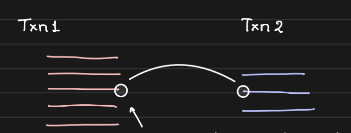

Txn 1 ↔ Txn 2

* Question: Should changes done at a certain point in Txn 1 be visible to Txn 2 before Txn 1 commits?

Remember: You pick relational databases for relations and ACID.

### Isolation Levels

Relational databases provide ACID guarantees; and the *I* in ACID is 'Isolation', and isolation levels help us tune it.

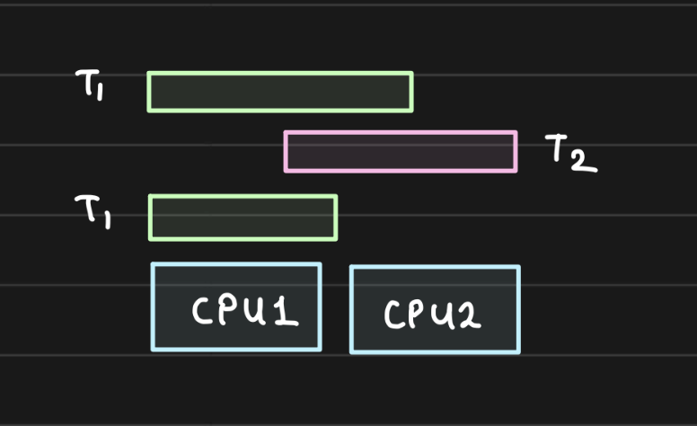

Isolation levels dictate how much one transaction knows about the other. We will look at each with examples:

1. Repeatable Reads
    * Consistent reads within the same transaction.
    * Even if another transaction commits, the first transaction will not see the changes (if value already read).

2. Read Committed
    * Reads within the same transaction always read fresh value.
    * Con: Multiple reads within the same transaction can be inconsistent.

3. Read Uncommitted
    * Reads even uncommitted values from other transactions.
    * Known as a "dirty read".

4.  Serializable (depends on engine)
    * Every read is a locking read.
    * While one transaction reads, others will have to wait.


> Storage engines can alter the implementation so read documentation before you alter settings.

# Scaling Databases

Databases are the most important component of any system out there. It makes or breaks your system. Hence, it is critical to understand how to scale them. *(Read your DB documentation.)*

These techniques are applicable to most databases out there. (for both *relational* and *non-relational*).

### Vertical Scaling

- Add more CPU, RAM, Disk to the database
- Requires downtime during reboot
- Gives ability to handle “scale” (more load)
- Has a physical hardware limitation

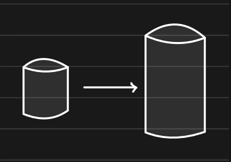

### Horizontal Scaling: Read Replicas

- Useful when read : write = 90 : 10
- Move reads to other database so that master is free to do writes
- API servers should know which DB to connect to for each operation
- Replication can be sync or async

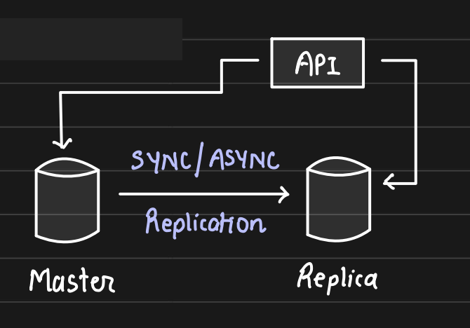

### Replication

Changes on one database (Master) need to be sent to Replica to maintain consistency.

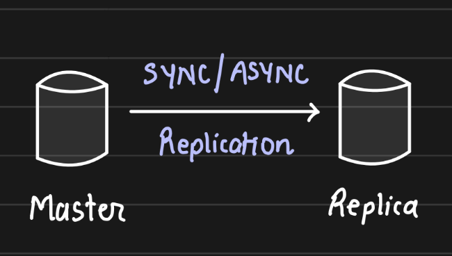

#### Two modes of replication:

1. Synchronous Replication
    - Strong consistency
    - Zero replication lag
    - Slower writes

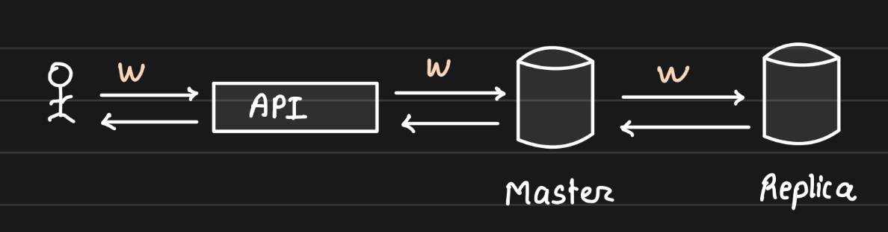

2. Asynchronous Replication
    - Eventual consistency
    - Some replication lag
    - Faster writes

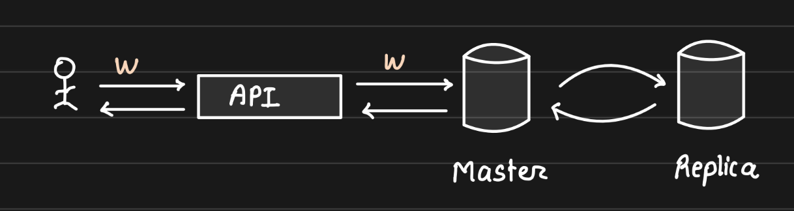

### Horizontal Scaling: Sharding

Because one node cannot handle all the data/load we split the data into multiple exclusive subsets. Writes on a particular row/document will go to one particular shard. This way, we scale our overall database load

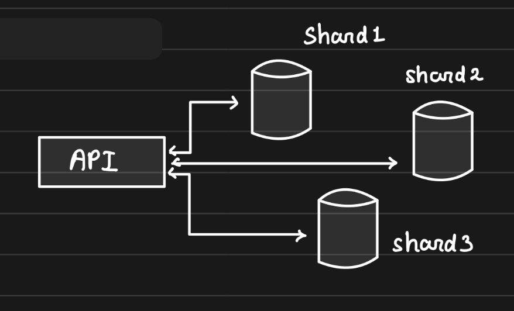

**Note:**

* Shards are independent
* No replication between them
* API server needs to know whom to connect to, to get things done
* Some databases has a proxy that takes care of routing
* Each shard can have its own replica (if needed)

## Sharding and Partitioning

- **Sharing**: Method of distributing data across multiple machines.
- **Partitioning**: Splitting a subset of data within the same instance.

### How a Database is Scaled?

A database server is just a database process (mysqld, mongod) running on an EC2 machine.

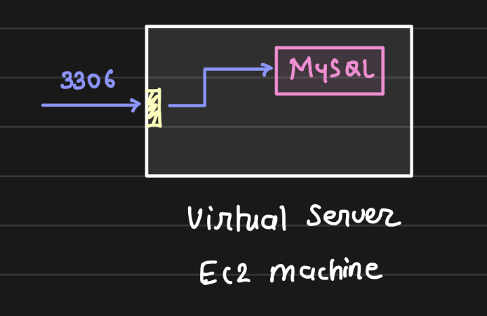

You put your database in production, serving real traffic.

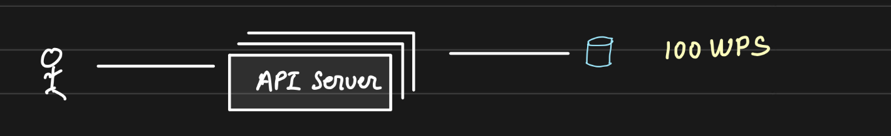

You are getting more users, that your DB is unable to manage. You scale up your DB... giving it more CPU, RAM and Disk. That makes a bulkier server + read replicas.

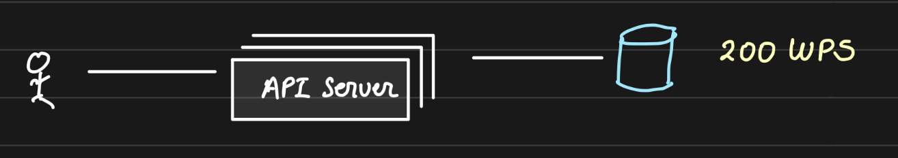

Your product went viral and your bulky database is unable to handle the load, so you scale up again.

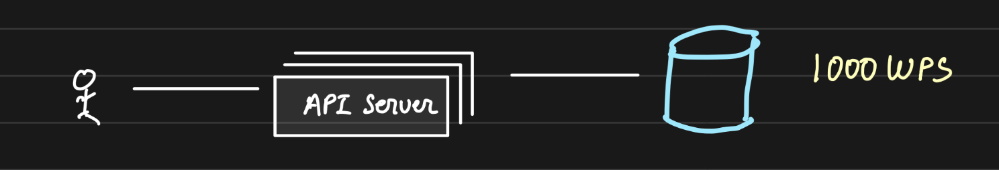

BUT, after a certain stage you know you would not be able to scale "up" your DB because **vertically scaling has limit**.

So, you will have to resort to Horizontal Scaling.

Say, one DB server was handling 1000 WPS and we cannot scale up beyond that but we are getting 15000 WPS, we scale horizontally and _split_ the data.

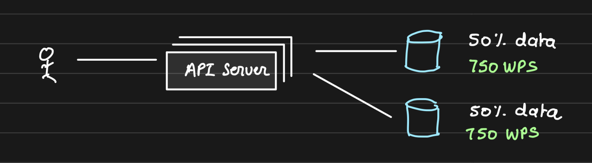

By adding one more database server, we reduced the load to 750 WPS on each node and thus handled higher throughput.


Each database server is thus a **shard** and we say that the database is **partitioned**.

Overall, a database is sharded while the data is partitioned.

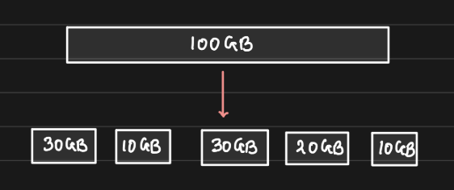

You partitioned the 100GB of total data into 5 mutually exclusive partitions. Each of these partitions can either live on one database server or a couple of them can share one server. And this depends on the No. of **shards** you have.

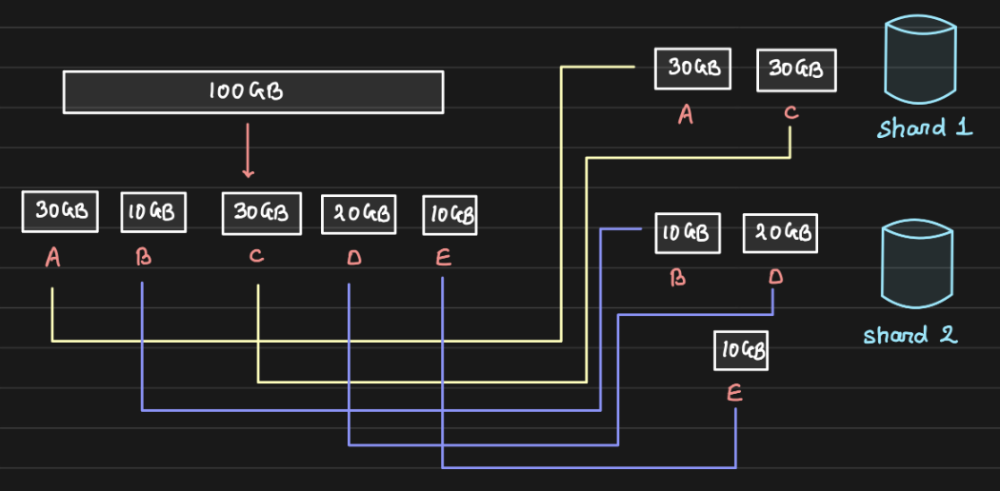

5 partitions of our 100GB dataset is distributed across 2 shards.

#### How to partition the data?
There are two categories of partitioning:

1. Horizontal Partitioning
2. Vertical Partitioning

When we "split" the 100GB data, we could have used either of the ways but deciding which one to pick depends on **load, usecase and access patterns**.
|              | Partitioning |        |        |
|--------------|:------------:|--------|--------|
| Sharding     |              | No     | Yes    |
|              | No           | 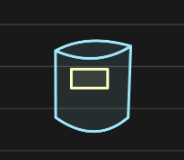 | 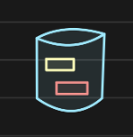 |
|              | Yes          | 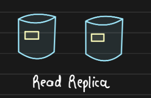 | 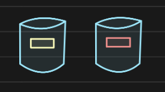 |

#### Advantages of sharding

* Handle large Reads and Writes
* Increase overall storage capacity
* Higher availability

#### Disadvantages of sharding

* Operationally complex
* Cross-shard queries are expensive

## Non-Relational Databases

It is a very broad generalization of databases that are non-relational (unlike MySQL, PostgreSQL, etc.)

But this does not mean all non-relational databases are similar.

### What makes Non-Relational Databases interesting?

Most non-relational databases are **shard** out-of-the-box! That means you get horizontal scaling for free.

We talk about 3 most important types of NoSQL databases:

1. Document DBs (MongoDB, Elasticsearch)
- Mostly JSON based
- Supports complex queries [almost like relational sql databases]
- Partial updates to documents is possible [can do `total_posts += 1` without re-writing the entire document]
```json
{
    "user_id": ___,
    "total_posts": 270,
}
```

- Closest to relational databases
- Best used for in-app notification service, catalog service

2. Key-Value Stores (Redis, DynamoDB, Aerospike)
- Extremely simple databases

```
GET(k)
PUT(k, v)
DEL(k)
```

- Limited functionalities (GET, PUT, DEL)
- Meant for key-based access patterns
- Does not support complex queries (aggregations)
- Can be heavily sharded and partitioned
- Best used for: profile data, order data, auth data, messages [most of the usecases], etc.

You can use relational databases and document DBs as KV stores.

3. Graph Databases (Neo4j, Neptune, Dgraph)
- What if our graph datastructure had a database?
- It stores data that are represented as nodes, edges and relations

eg. A --follows-> B
eg. Anirudh --Bought-> iPad

- Great for running complex graph algorithms
- Powerful to model social networks, recommendation & fraud detection
